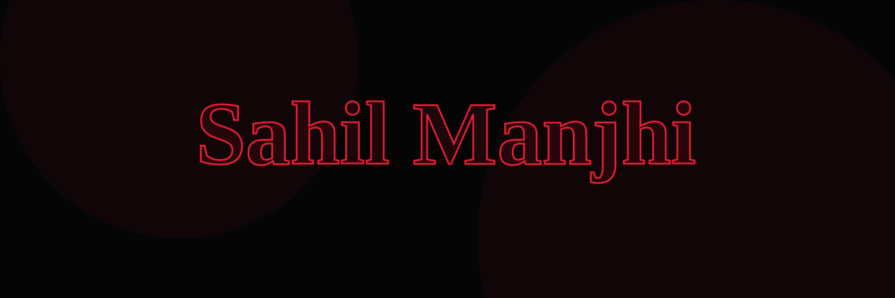
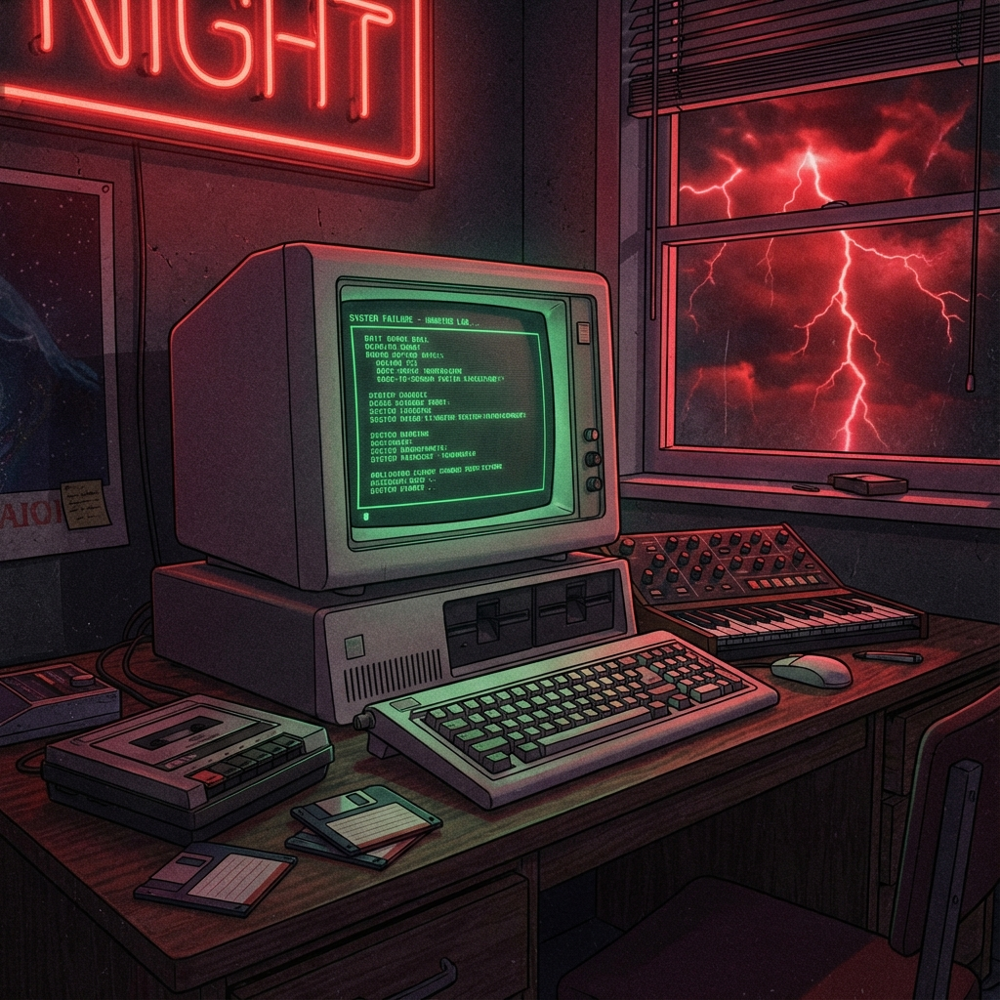

<!--<h2 align="left">Sahil Manjhi</h2> -->

  

   

---

 
  <table>
    <tr>
      <td width="50%" valign="top">
        <h2 align="center">About Me 🕹️</h2>
         
        

          Hi, I'm <b>Sahil Manjhi</b>, a passionate developer navigating the Upside Down of code. I specialize in building robust web applications and exploring the depths of Artificial Intelligence.
        

        

          🔭 I’m currently working on <b>React & Python Projects</b> 
          🌱 I’m currently learning <b>Generative AI & System Design</b> 
          ⚡ Fun fact: <i>"Friends don't lie, and neither does my code (mostly)."</i>
        

        

          <h3>Connect with me 🤝</h3>
          
          
          
          
        

      </td>
      <td width="50%" align="center">
        
      </td>
    </tr>
  </table>

---

<h2 align="center">Tech Stack 📼</h2>

  

 

---

<h2 align="center">Stranger Stats 🩸</h2>

  
  
   
  

  

---

  <h3>Holopins 🎖️</h3>
  

  

